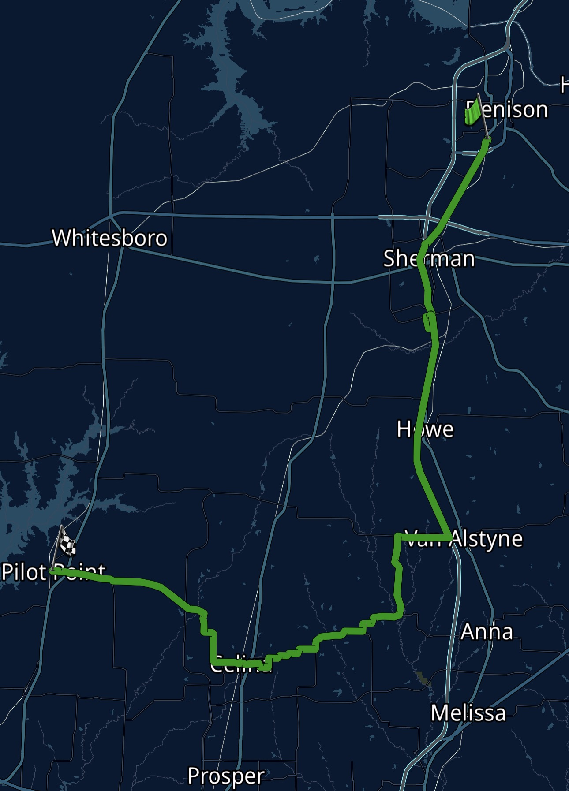
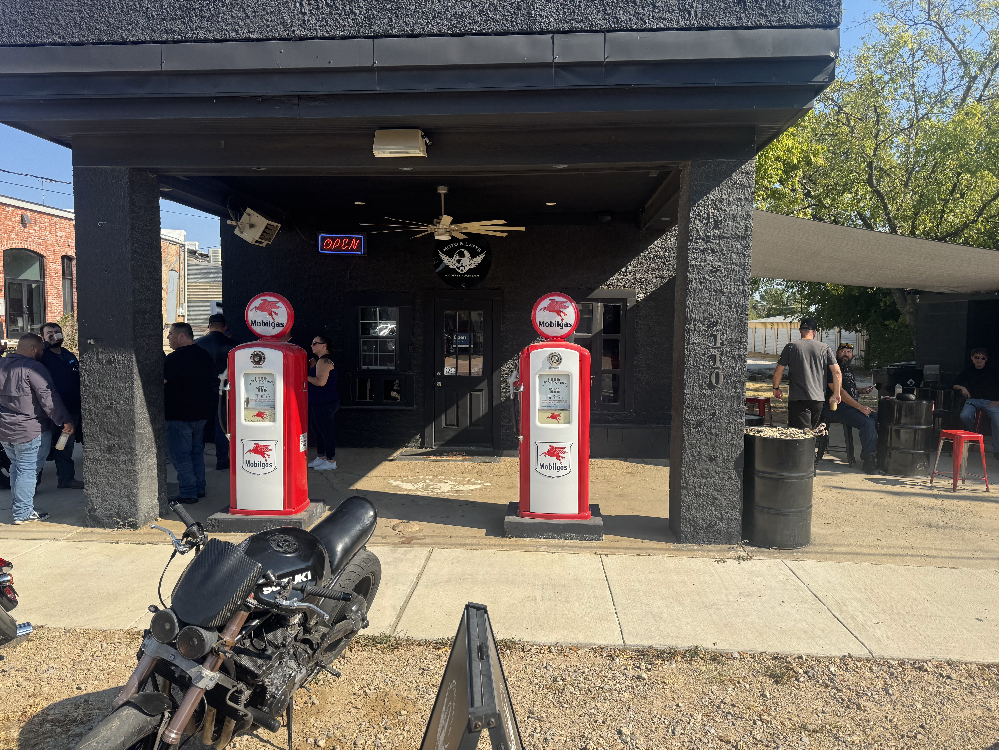
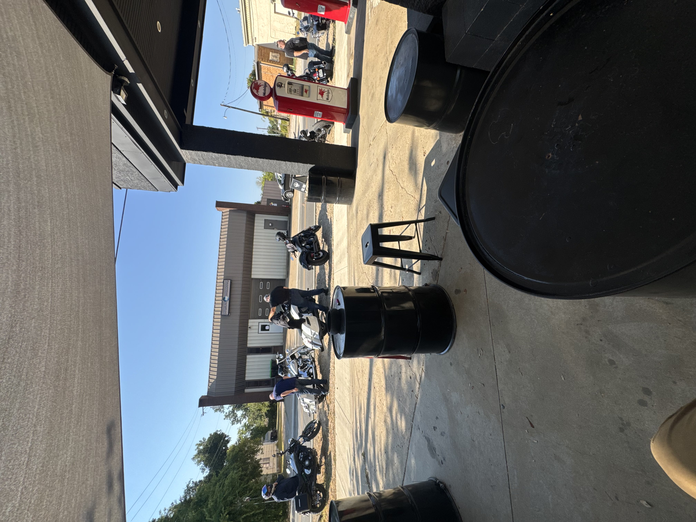
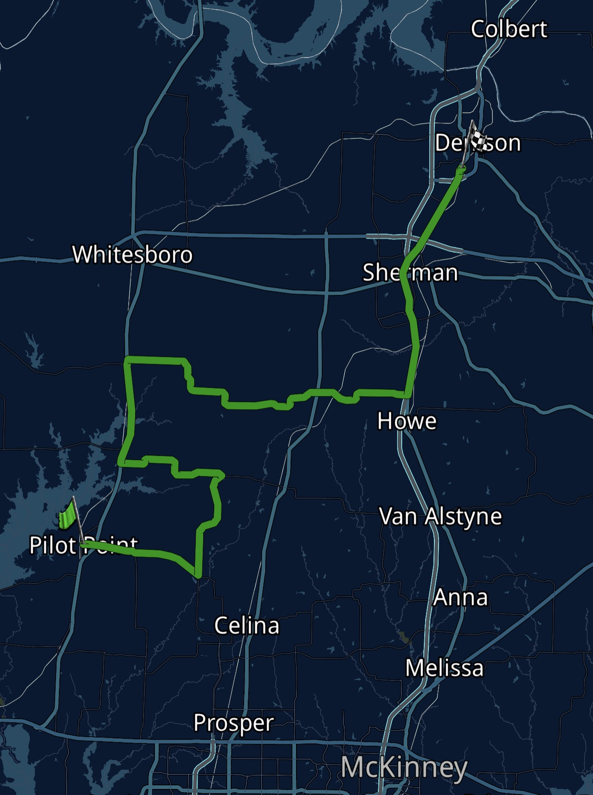
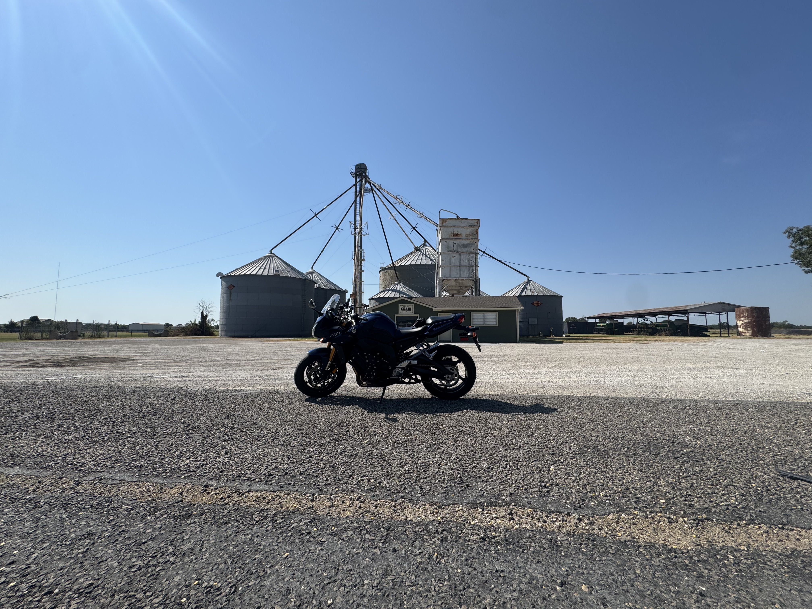
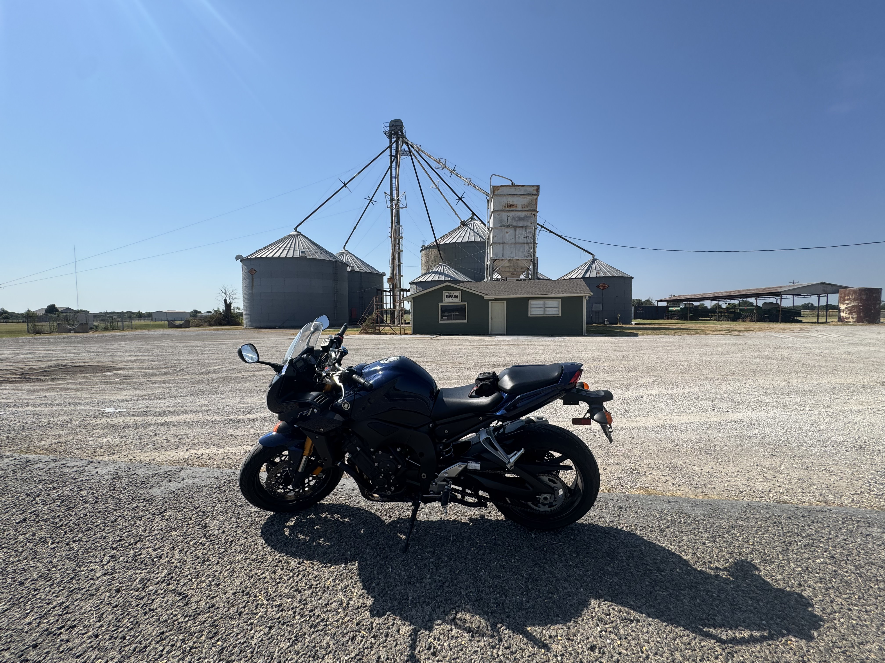

Today I went for my first solo touring ride. It being a Saturday, I wanted to take advantage of the nice weather in the morning. It has been ridiculously hot here in North Texas lately with temps typically in the 90s and 100s. This morning however, it was a cool 75 degrees. I have missed this amazing riding weather.

## The Route

I set out today with the intention of riding down to Moto Latte. This is a well-known, motorcycle-focused coffee shop in Pilot Point, TX. I planned out my route and left the house around 8am. Before getting too far, I stopped at the QT on 1417 to fuel up and see if I ran into any other riders. This seems to be a popular spot to meet up before going on longer rides, but I didn't see anyone this time.

The beginning of the ride was pretty uninteresting, as I rode Highway 75 all the way down to Van Alstyne. This was not the most direct route to moto latte, but I did this because I also wanted to hit FM 455 on the way there. I've heard from other riders in the area that this is kind of the best they have when it comes to twisties up here. After riding it, I am not terribly impressed. It definitely had some fun turns, but they were nothing super exciting and quite frankly, there were too many intersections in the middle of the turns for my liking. There was also some construction at the beginning. Luckily though, it didn't block any of the road and really didn't impact my ride. Overall, it was a fun ride and relatively local to me. I probably wouldn't travel here just to ride this road, but if you're in the area, it's worth checking out.

## Moto Latte

I arrived at moto latte a little after 9. It's a neat little spot. I've heard there's usually some bikes out here on any given weekend, and I found this to be true today. I saw some cruisers, a couple of sport/naked bikes, and a couple sport-tourer/adventure bikes. I'm not a big coffee person, but I got a drink and sat outside for a bit. Everyone there was super friendly.

## Return Ride

On the way back, I thought I'd try something different just to see more while I'm out. I picked out a couple sections of road that looked decent on the map and added them to my route. These were not nearly as twisty as FM 455, but they actually turned out being pretty nice. I saw lots of flat farmland interrupted by the occasional small town. The roads had plenty of long, sweeping turns that I could actually enjoy with my FZ1 (as opposed to my supermoto). There was nothing crazy special in this route, but it was a fun, scenic, relaxing ride.

*My FZ1 in front of one of the farms.*

## Conclusion

I got home around 11am. I was tired, but it was a successful morning. In total, I rode 121 miles. I did run into one issue with the bike. It occasionally cuts out under acceleration, but I was able to figure out that it's just a clogged fuel tank vent line. It was a bit annoying, but I just stopped and opened the fuel tank lid whenever it started acting up. Should be an easy fix, but I had to just deal with it for today. This ride also gave me a taste of what long distance riding would be like on this bike. Overall, it's very comfortable, but I think I would add a taller windscreen and softer seat. I also need to get some different boots that are taller to keep the wind off my ankles and have more cushion in the soles. I am very happy that I got this bike, and I am thoroughly enjoying sport-touring on it. I'm looking forward to doing more adventures with it.

