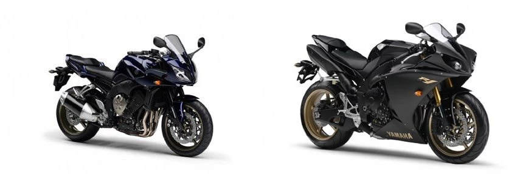
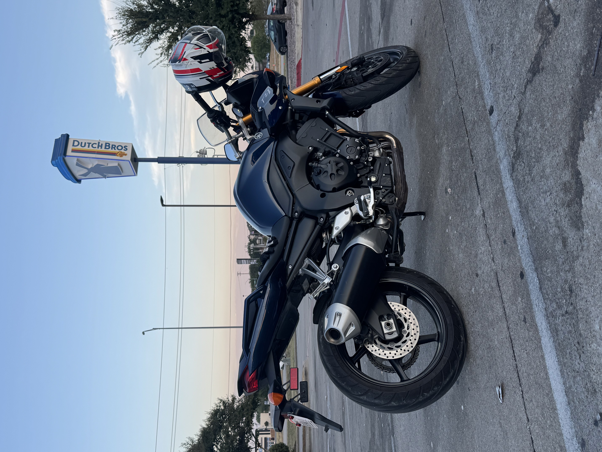
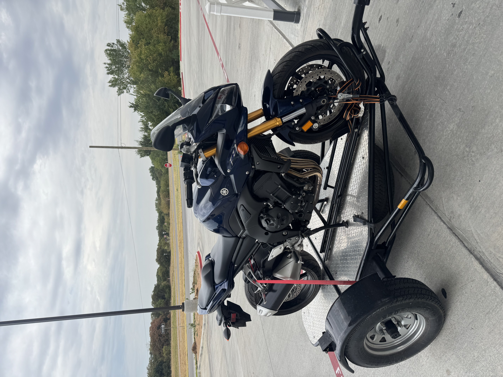
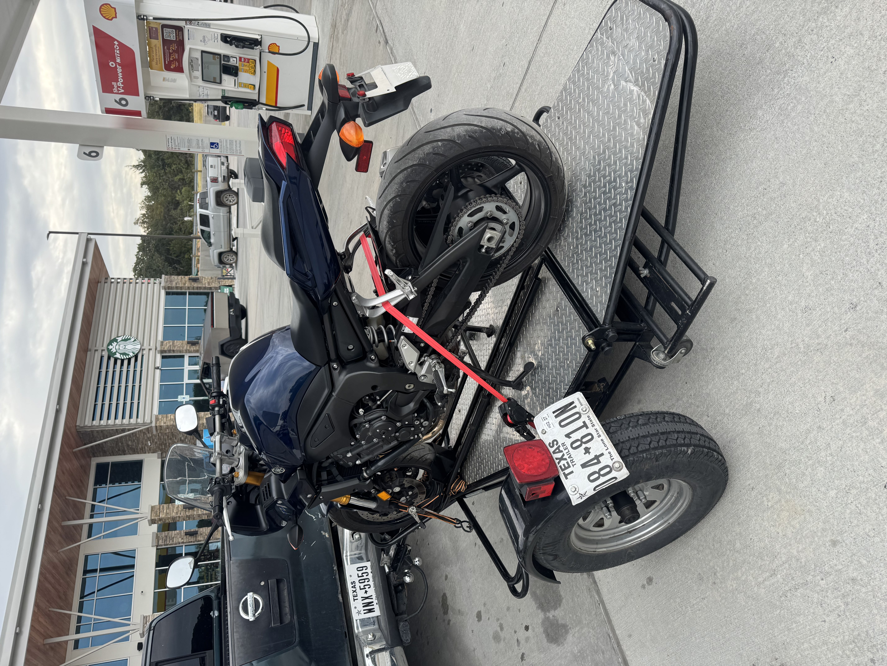
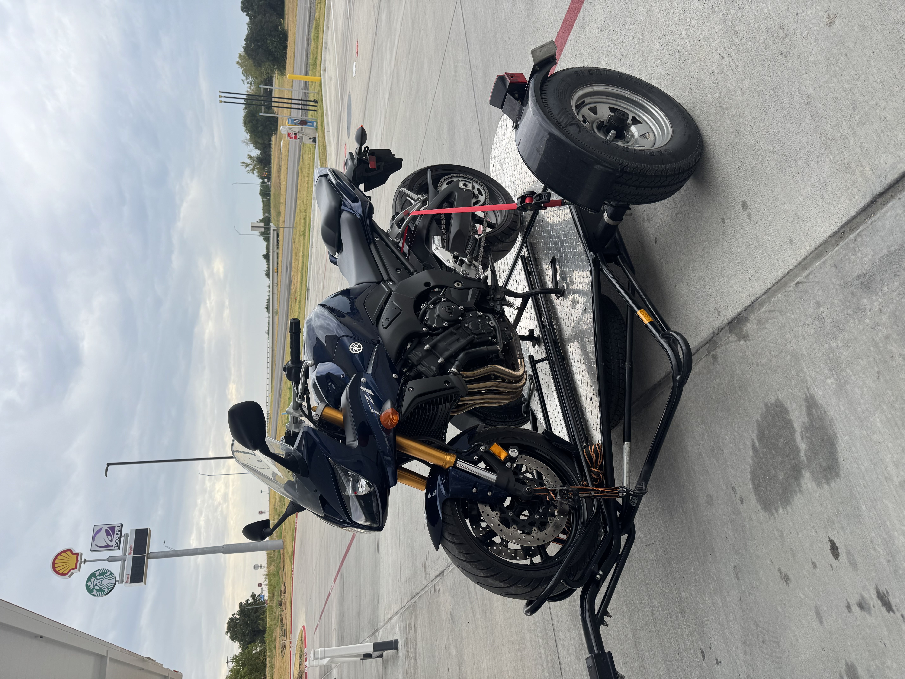

Yesterday, I bought a new to me, 2007 Yamaha FZ1. I have barely even ridden it, but I am very excited. I am already loving this bike.

## A Little Bit about the Bike

Like I said, it's a 2007 Yamaha FZ1. These bikes were also called the Yamaha "Fazer". Yamaha made a 600cc version, the FZ6 and a 1000cc version, the FZ1. These bikes actually share a motor with their supersport equivalents (the R6 and the R1 respectively). However, it is detuned to make more low end torque versus making all their power at high rpms. This results in a bike that gives you a very similar feel to your typical inline 4 cylinder supersport, but is much more usable for everyday riding.

Another unique thing about these bikes is the fairings. The Fazer would be considered a <abbr title="A style of bike derived from a sport bike but with no fairings and a more upright seating position">naked bike</abbr> due to it's upright seating position, usage of bars instead of clip-ons, and lack of traditional fairings. However, most modern naked bikes have no fairings. The Fazer has what I call "half-fairings". I have also heard them called "bikini fairings". This is not something you see on any modern bikes. It is sort of a relic of the early 2000s with bikes like the Yamaha Fazer, Suzuki SV, and Suzuki Bandit all having it.

*A FZ1 and R1 next to each other. Note the difference in the side and bottom fairings.*

## My Fazer

My FZ1 in particular was one hell of a find. Before me, this bike had only one owner. It was the 66 year old grandpa of the guy I bought it from. His grandpa had bought it from the dealership back in 2007, put 26,000 miles on it, and according to the guy I bought it from, quit riding about 8 years ago. I call this bike a "grandpa spec" not because it was literally owned by a grandpa (though that definitely contributes), but due to the condition it is in. This bike is completely stock. Never dropped. Not a single modification or scratch. It even has the stock muffler, rear fender, and levers. My fellow motorcycle riders will know those are some of the first things to go when upgrading a brand new bike. It feels like a time capsule. Other than the odometer reading of 26,000 miles, this bike is effectively still a showroom quality bike from 2007 almost 20 years later.

## Future Plans

I purchased this bike with the intent of doing some more long-distance, touring rides. Before this, my only bike was a 2022 Honda CRF450RL. I love my CRF and it is a ton of fun offroad, around town, and local rides, but I cannot go on the highway for more than a couple exits without being miserable. My new FZ1 is a very capable highway bike. I definitely will be taking it down to Dallas. Dallas is about an hour from us, and the other riders in Denison like to go down their occasionally for big events. However, I do want to work my way up to some longer rides. For that, I plan on doing a couple key modifications to my FZ1...

At first glance, one might say that I bought the wrong bike. I was looking for a sport-tourer. Comfy, very good for long distance riding, but still somewhat sporty and fun in the twisties. However, this is not purely a touring bike for me. I intend on riding it all the time, so I specifically wanted a bike that was on the more sporty side of sport touring. The Fazer is not classified as a sport-tourer, but being a naked bike, it is naturally a lot more comfortable than your average sport bike. It also has a lot more wind coverage than your typical naked bike. In my opinion, it is the perfect compromise between sport bike and sport-tourer. A larger windscreen, aftermarket comfort seat, and a luggage rack will turn this into the ultimate sport touring bike for me.

## Picture Dump

